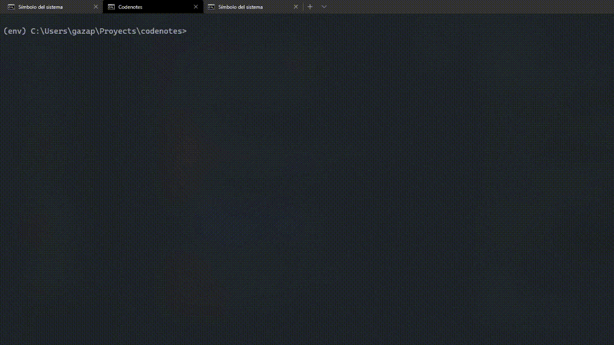

# Codenotes
*All your annotations without quitting the terminal*

[](https://badge.fury.io/py/Codenotes)


[](https://github.com/psf/black)


A simple CLI where you can save and view all your created annotations

## Installation
To install `codenotes`, it is recommended to use pip:
```
pip install codenotes
```
You can install it from source. Clone this repository and use pip to install:
```
git clone https://github.com/EGAMAGZ/codenotes.git
cd codenotes
pip install .
```

If `codenotes` is already installed and you would like to update it, use:
```
pip install --upgrade codenotes
```
If updating local version, use:
```
cd codenotes
git pull
pip install --upgrade .
```
## Usage
Run `codenotes` to display the usage text.

```
codenotes <annotation> <action> <flags>
```


**Features**
* Create notes and tasks, and saves them in a category optionally specified
* Create categories for the different annotations
* Check the annotations or categories that will be created with a preview
* Create categories where tasks or notes will be saved
* Search for annotations created today, yesterday, during the week, month and ever, and by keywords
* Search for categories created in each type of annotation or in all of them at the same time, and search by keywords
## Unit Tests
`codenotes` unit tests are written for `unittest`, using `tox` and `pyenv`. List of python versions tested and supported:
* 3.9
* 3.10.0b3

## License
MIT License

Copyright (c) 2021 Gamaliel Garcia
